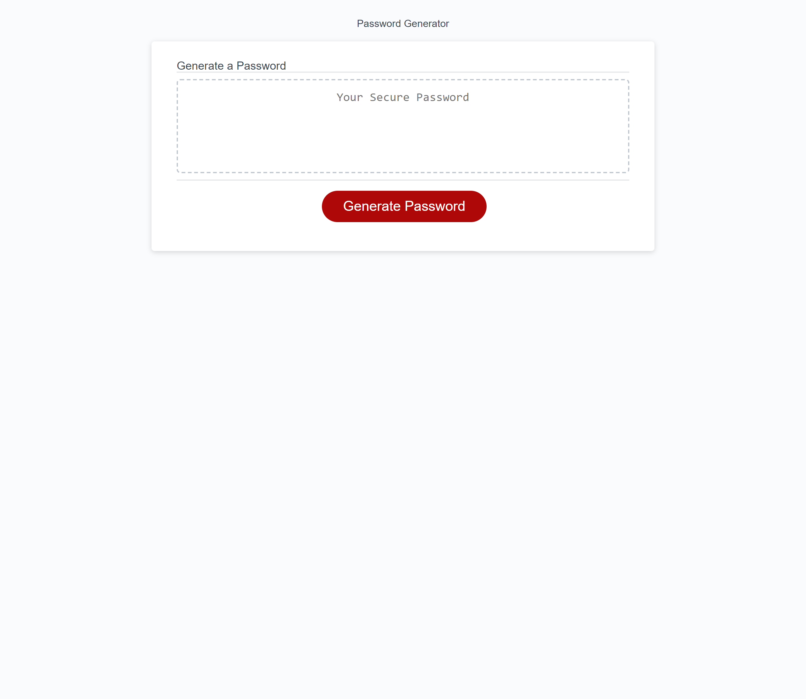

# PASSWORD GENERATOR

## Description
 I wanted to test the knowledge I acquired during the third week of the bootcamp and so I build an algorithm that could generate a random password after asking for specific criteria from the user to create a safe password that meets their needs, using mostly loops and if's I was able to make this happen, I feel like a have a solid grasp of the subject and I'm excited about the rest

## Usage

The app is very basic and straight forward to use, click the big red bottom, answer a few questions and

## Credits

Inspiration take from:

https://stackoverflow.com/questions/1349404/generate-random-string-characters-in-javascript

## License

No license added
